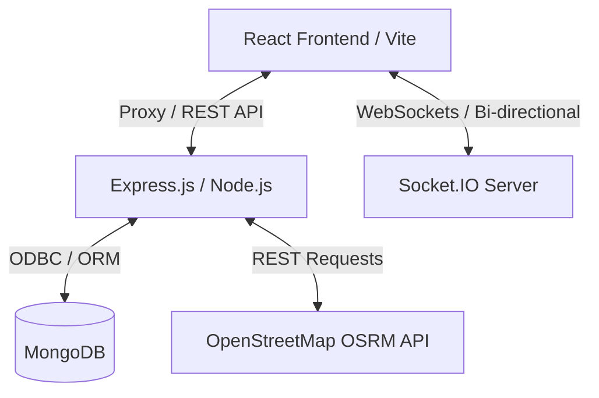

# FleetFlow Management System: Project Activity Guide

This guide serves as a complete user manual and verification guide for the **FleetFlow Management System**. It walks you through starting the services, logging in as various roles, executing commercial fleet dispatch lifecycles, tracking vehicles on the interactive live telemetry map, logging fuel/maintenance costs, and reviewing financial reports.

---

## 1. Project Overview

### Purpose
FleetFlow is an enterprise logistics and fleet operations dashboard designed to manage heavy transport vehicles, commercial drivers, live GPS routing telemetry, maintenance logs, cargo safety incidents, and P&L financial accounts.

### System Architecture


*   **Frontend**: Single Page Application built using React (workspace `client`), Vite, TailwindCSS, Recharts, and Leaflet Maps.
*   **Backend**: REST and WebSocket server built using Express (workspace `server`), Mongoose ORM, and Socket.IO.
*   **Routing Engine**: Employs the OpenStreetMap OSRM API to solve distance calculations, determine route road coordinates, and feed the telemetry engine.
*   **Telemetry Simulation**: Runs a server-side 5-second interval loop that moves dispatched vehicles along resolved routes, updating coordinates, speed, heading, and emitting updates via WebSockets.

---

## 2. Initial Setup & Launch Instructions

### A. Prerequisites
Ensure you have the following installed on your host system:
*   [Node.js (v18 or higher)](https://nodejs.org)
*   [MongoDB Community Server (running locally)](https://www.mongodb.com/try/download/community)

### B. Starting the Application
From the project root directory (`FleetFlow-Team-NODEXA`), open a terminal and run:

```bash
# 1. Install all dependencies across workspace
npm install

# 2. Seed the MongoDB database with dummy records
npm run seed --workspace=server

# 3. Start client and server in development mode
npm run dev
```

The database seeder cleans existing records and populates standard logistics entities. The application will be serving at:
*   **React Client**: `http://localhost:5173/`
*   **Express API Server**: `http://localhost:5000/`

### C. Demo Login Credentials
All roles share the same passphrase: **`password123`**

| Role | Username / Email | Key Operations |
| :--- | :--- | :--- |
| **Manager** | `manager@fleetflow.com` | User administration, P&L access, overrides, leaves approvals. |
| **Dispatcher**| `dispatcher@fleetflow.com` | Daily routing, vehicle onboarding, scheduling, and starting dispatches. |
| **Driver** | `driver@fleetflow.com` | Personal schedule view, telemetry map feedback, log fuel fills. |
| **Safety Officer** | `safety@fleetflow.com` | Log safety incidents, declare breakdowns, resolve maintenance schedules. |
| **Financial Analyst**| `finance@fleetflow.com` | Check expense receipts, export finance ledger sheets, review charts. |

---

## 3. End-to-End Core Workflow

The fleet cargo lifecycle operates through the following phase flow:

```
[Onboard Assets] ➔ [Schedule & Route Planning] ➔ [Dispatch Transit] ➔ [Live Map Tracking] ➔ [Incident / Maintenance] ➔ [Delivery Completion] ➔ [P&L Reporting]
```

1.  **Asset Sourcing**: The Manager or Dispatcher registers trucks (`Vehicle`) and drivers (`Driver`).
2.  **Scheduling**: The Dispatcher creates a trip draft (`DRAFT`), specifying cargo, origin, destination, and assignments.
3.  **Conflict Validation**: The system verifies driver licenses (must not be expired) and checks that neither resources are overlapping on the scheduled date.
4.  **Dispatch transit**: Once ready, the Dispatcher clicks **Start Transit**.
5.  **Live Telemetry**: The vehicle is animated on the Map; Socket.IO streams coordinate ticks.
6.  **Incident Reporting**: Safety incidents (e.g., breakdown or overspeed warning) can be logged, routing vehicles to repair stations.
7.  **Auto Completion**: Once the coordinates reach the destination, the server closes the trip, updating odometer readings, payout rates, and allocating revenue.
8.  **P&L Ledger**: The Financial Analyst files expenses, exports sheets, and analyzes dashboard charts.

---

## 4. Role-by-Role Activity Guide

### Manager Portal
*   **Dashboard View**: Real-time aggregated values of total assets, P&L net profits, utilization margins, expired licenses, and active dispatches.
*   **Vehicles Tab**: Add new vehicles, view active documents (RC, PUC, Insurance, Permits) and update files.
*   **Drivers Tab**: Onboard drivers, view safety score averages, and approve/reject leave requests.
*   **Trips Tab**: Review all logs, cancel active trips, or complete trips.
*   **Users Panel**: Create user accounts and update user roles.

### Dispatcher Portal
*   **Vehicles & Drivers**: Edit Status (AVAILABLE/IN_SHOP/SUSPENDED) of units.
*   **Trip planner**: Enter origin/destination, query road path points from OSRM, review distance/fuel-cost estimates, and choose available assets.
*   **Schedule Window**: Create scheduled trip calendar slots, look for conflicts, and run the Auto-Dispatcher ticker.
*   **Fuel Entry**: Log fuel fills on behalf of drivers.

### Driver Portal
*   **Personal Dashboard**: Shows current shift details, kilometers driven, cargo weights, and safety stats.
*   **Trips Screen**: View active route coordinates, dispatch times, and remaining journey distance.
*   **Logger**: Submit fuel station costs, odometer readings, and station logs.

### Safety Officer Portal
*   **Incidents Log**: View safety logs. Register critical breakdown, speed, or fatigue alerts. Update status to `UNDER_INVESTIGATION` or `RESOLVED`.
*   **Maintenance Register**: Create planned checks or emergency repairs. Mark entries `RESOLVED` and file parts/repair costs. This automatically overrides vehicle status to `IN_SHOP` (blocking dispatches) and returns it to `AVAILABLE` upon completion.
*   **Telemetry Monitor**: Search vehicles on live tracking to coordinate breakdown relief.

### Financial Analyst Portal
*   **Analytics Page**: Interactive charts tracking fuel cost efficiency metrics ($km/L$), ROI (Revenue/OPEX per vehicle), and monthly completed trip counts.
*   **Expenses Ledger**: File disbursements (labor cost, maintenance checks, fuel station receipts).
*   **Financial Reports**: Download consolidated CSV ledgers containing transactional records.

---

## 5. Complete Demo Scenario Walkthrough

Follow these instructions to experience the full operational lifecycle:

### Step 1: Onboard Driver and Vehicle (Manager / Dispatcher)
1.  Log in as **`manager@fleetflow.com`** / **`password123`**.
2.  Go to **Vehicles** page ➔ Click **Add Vehicle** ➔ Name: `BharatBenz Cargo Heavy`, Plate: `KA-51-MM-7722`, Capacity: `32000` ➔ Submit.
3.  Go to **Drivers** page ➔ Click **Add Personnel** ➔ Name: `Dev Pratap`, License: `KA-512023000998`, Expiry: `12/31/2030` ➔ Submit.

### Step 2: Schedule & Route Solver (Dispatcher)
1.  Log out and log in as **`dispatcher@fleetflow.com`** / **`password123`**.
2.  Navigate to **Trips** ➔ Click **New Trip**.
3.  Select Origin: `Mumbai`, Destination: `Pune`, Cargo: `12000`, Vehicle: `KA-51-MM-7722`, Driver: `Dev Pratap`.
4.  Click **Estimate Route & Suggest Vehicle**. The coordinates and route shape will be queried and returned. Click **Save Draft**.

### Step 3: Dispatch Transit (Dispatcher)
1.  On the **Trips** table, find the newly created draft.
2.  Click **Start Transit** (or Dispatch). 
3.  The status updates to **DISPATCHED**. Behind the scenes, the server telemetry engine launches a routing ticker.

### Step 4: Monitor Live Telemetry (Safety Officer / Driver)
1.  Log out and log in as **`safety@fleetflow.com`** / **`password123`** (or Manager/Driver).
2.  Navigate to **Live Tracking**.
3.  Select the active trip from the sidebar. You will see:
    *   An animated marker tracking the vehicle's position.
    *   A blue line indicating path.
    *   Live speed, heading degree, remaining distance, and ETA updating every 5 seconds.

### Step 5: Incident and Maintenance (Safety Officer)
1.  From the **Live Tracking** details panel, notice a breakdown scenario.
2.  Navigate to **Incidents** ➔ Click **Report Incident** ➔ Type: `Vehicle Breakdown`, Vehicle: `KA-51-MM-7722`, Driver: `Dev Pratap`, Description: `Tire puncture at highway bypass.` ➔ Submit.
3.  Navigate to **Maintenance** ➔ Click **Log Repair** ➔ Select the vehicle, describe the work, and set status to `PENDING`. The vehicle is automatically flagged as `IN_SHOP`.
4.  Once resolved: Click **Complete Repair** ➔ Enter Cost: `2500` ➔ Submit. The vehicle status returns to `AVAILABLE`.

### Step 6: Completion and Financial Audit (Financial Analyst)
1.  Once the telemetry marker reaches the destination, the trip status updates to **COMPLETED** (trip details display final revenues, odometer ticks, and fuel consumption).
2.  Log out and log in as **`finance@fleetflow.com`** / **`password123`**.
3.  Navigate to **Finance Ledger** ➔ Verify that the trip revenue and repair costs are recorded in the current month's aggregates.
4.  Click **Export CSV** to download the record sheet.
5.  Go to **Analytics** to view the performance metrics.

---

## 6. Verification and Testing Guide

### Test Case 1: Driver License Expiry Gate
*   **Scenario**: Attempting to dispatch a driver whose license is expired.
*   **Steps**:
    1. Select a draft trip.
    2. Assign driver `Rajesh Kumar` (his license expired in the past).
    3. Click **Start Transit**.
*   **Expected Behavior**: The client displays a block alert stating the driver's license has expired, maintaining the trip status as `DRAFT` and preventing starting transit.

### Test Case 2: Schedule Conflict Gate
*   **Scenario**: Creating a trip overlapping active resources.
*   **Steps**:
    1. Create a trip scheduled for today with a specific truck.
    2. Create a second trip scheduled for today with that same truck.
*   **Expected Behavior**: The server rejects the second entry with a conflicts warning.

### Test Case 3: Live Map Telemetry Socket Stream
*   **Scenario**: Telemetry is broadcasting changes.
*   **Steps**:
    1. Open the Live Tracking page.
    2. Open your Web browser's Console (`F12`) and check the console logs.
*   **Expected Behavior**: You should see logs indicating `Telemetry socket connected` and incoming JSON packets (`telemetryUpdate`) from Socket.IO.

---

## 7. Troubleshooting

*   **Map displays grid lines but no roads/tiles**:
    *   *Cause*: No internet connectivity. Leaflet requires a web connection to fetch tiles from `openstreetmap.org`.
    *   *Solution*: Verify host machine's internet connection.
*   **Socket.IO Connection Warnings**:
    *   *Cause*: Port conflict or the backend server is offline.
    *   *Solution*: Run `npm run dev` to launch the backend service. Check if a local process is occupying port 5000 (`netstat -ano | findstr 5000`).
