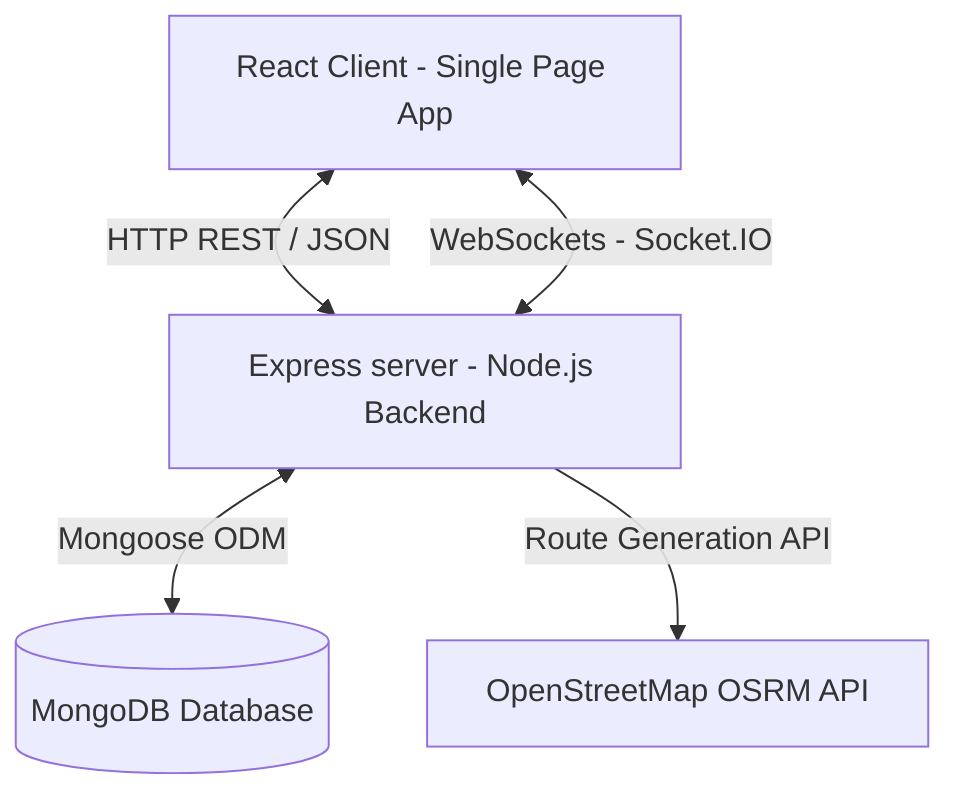

# Project Analysis: FleetFlow Management System

This document provides complete, high-fidelity technical documentation for **FleetFlow**, a modern fleet management system. It details the architecture, code flow, module dynamics, and business workflows to serve as a technical reference.

---

## 1. Project Overview & Objectives

FleetFlow is a complete, real-time logistics and fleet management platform designed to automate and supervise shipping workflows. Its goals are:
*   **Asset Overhead Optimization**: Provide unified auditing of vehicle maintenance lifecycle, duty availability, fuel efficiency, and revenue mapping.
*   **Intelligent Dispatch & Timeline Planning**: Enable conflict-free trip scheduling and live vehicle mapping.
*   **Real-Time Fleet Tracking**: Update coordinates dynamically along verified road paths using OSRM to track vehicle speeds, headings, ETAs, and progress, with automatic trip completion.
*   **Role-Based System Audit**: Restrict operational flows to authorized managers, dispatchers, drivers, safety officers, and financial analysts.

---

## 2. System Architecture & Overall Workflow

FleetFlow is structured as a decoupled **Client-Server Architecture** utilizing an npm Workspaces configuration:



### Overall Workflow Lifecycle
1.  **Onboarding**: Admins or personnel sign up defining specific operational roles.
2.  **Asset Enrollment**: Fleet assets (Vehicles) and drivers are registered in standard rosters.
3.  **Scheduling & Conflict Check**: Dispatchers draft new trips. The scheduling processor validates driver/vehicle availability, warns of license expiry, and confirms cargo weight bounds.
4.  **Transit Dispatching**: Toggling a trip to `DISPATCHED` automatically locks both the Vehicle and Driver status to `ON_TRIP`.
5.  **Websocket Telemetry Tracking**: On dispatch, the node telemetry engine queries OSRM for actual road coordinates. It moves the vehicle checkpoint-by-checkpoint, broadcasting live latitude, longitude, heading angle, speed, distance remaining, and ETA over Socket.IO.
6.  **Auto Completion**: On hitting the final route index, the server marks the trip `COMPLETED`, updates vehicle odometers, calculates billing revenue (₹25/kg), and releases driver/vehicle back to `AVAILABLE`.
7.  **Logistics Audits**: Maintainers file repair forms (setting vehicles to `IN_SHOP`), safety officers report incident files, and financial analysts parse expenses.

---

## 3. Folder Structure & Directory Manifest

The project is structured under `FleetFlow-Team-NODEXA/`:

```
├── client/                     # frontend workspace React.js + Vite
│   ├── public/                 # Static asset public directory
│   ├── src/
│   │   ├── components/         # Shared visual components (Layout, ProtectedRoute, StatusPill, etc.)
│   │   ├── pages/              # Routing modules (Dashboard, Vehicles, Trips, LiveTracking, Drivers, etc.)
│   │   ├── services/           # Axios instance configuration & token injections
│   │   ├── App.jsx             # React application router tree and route definitions
│   │   └── main.jsx            # Entry point rendering the React application bundle
│   ├── index.html              # HTML shell hosting Leaflet interactive map CDNs
│   ├── vite.config.js          # Vite config configuring dev ports and WebSocket proxies
│   └── tailwind.config.js      # Styling parameters, tokens, and font styles
├── server/                     # backend workspace Express.js + Node.js
│   ├── controllers/            # Controller layers handling HTTP request/response business logic
│   ├── middleware/             # Route guards (Token verifiers, Role check gates)
│   ├── models/                 # Mongoose schemas (User, Vehicle, Driver, Trip, Lease request, Incidents, etc.)
│   ├── routes/                 # Express route endpoint mappings
│   ├── utils/                  # Telemetry background tickers and route solvers
│   ├── server.js               # Express entry point, socket hookups, and error middlewares
│   └── package.json            # Node backend script and dependency metadata
```

---

## 4. Technology Stack

*   **Frontend**: React (Single Page Application, functional components, Hooks), React Router DOM (client navigation).
*   **Interactive Maps**: Leaflet Map Engine (initialized via standard CDNs using direct imperative controls via `window.L`).
*   **Websocket Client**: Socket.IO Client (establishing keep-alive telemetry socket hooks to `/socket.io`).
*   **Styling**: HTML5/CSS3 styled with custom Tailwind themes.
*   **Backend**: Node.js and Express.js (REST APIs, HTTP server routing, WebSocket integration).
*   **Websocket Server**: Socket.IO (for real-time backend telemetry broadcast sweeps).
*   **Database**: MongoDB (NoSQL) with Mongoose ODM (Data modeling, validations, lookups).
*   **Routing API**: OpenStreetMap OSRM (Calculates route geo-coordinates on real streets).

---

## 5. Database Schema & Data Models

### User Schema (`server/models/User.js`)
*   `name`: String
*   `email`: String (Unique, Indexed)
*   `password`: Hash String (bcryptjs)
*   `role`: String (Enum: `["Manager", "Dispatcher", "Driver", "SafetyOfficer", "FinancialAnalyst"]`)

### Vehicle Schema (`server/models/Vehicle.js`)
*   `name`: String (e.g. Scania R-450)
*   `licensePlate`: String (Unique)
*   `maxCapacity`: Number (kg capacity limits)
*   `odometer`: Number (Default: `0`)
*   `status`: String (Enum: `["AVAILABLE", "ON_TRIP", "IN_SHOP", "RETIRED"]`)
*   `acquisitionCost`: Number
*   `revenue`: Number
*   `insuranceExpiry`: Date
*   `permitExpiry`: Date

### Driver Schema (`server/models/Driver.js`)
*   `name`: String
*   `licenseNumber`: String
*   `licenseExpiry`: Date
*   `status`: String (Enum: `["AVAILABLE", "ON_TRIP", "SUSPENDED"]`)
*   `totalDistance`: Number (Default: `0`)
*   `totalTrips`: Number (Default: `0`)
*   `totalRevenue`: Number (Default: `0`)

### Trip Schema (`server/models/Trip.js`)
*   `vehicle`: ObjectId ➔ Ref: `Vehicle`
*   `driver`: ObjectId ➔ Ref: `Driver`
*   `cargoWeight`: Number
*   `status`: String (Enum: `["DRAFT", "DISPATCHED", "COMPLETED", "CANCELLED"]`)
*   `origin`: String
*   `destination`: String
*   `scheduledDate`: Date
*   `estimatedDistance`: Number
*   `estimatedFuelCost`: Number
*   `actualDepartureTime`: Date
*   `actualArrivalTime`: Date
*   `distance`: Number / `fuelUsed`: Number / `revenue`: Number
*   `notes`: String
*   `routeCoordinates`: Array of [[Number, Number]] (Storing [lat, lng] array)
*   `currentLat`: Number / `currentLng`: Number
*   `currentRouteIndex`: Number
*   `currentSpeed`: Number / `currentHeading`: Number
*   `lastTelemetryUpdate`: Date
*   `telemetryStatus`: String (Enum: `["MOVING", "IDLE", "STOPPED", "OFFLINE"]`)

### LeaveRequest Schema (`server/models/LeaveRequest.js`)
*   `driver`: ObjectId ➔ Ref: `Driver`
*   `startDate`: Date / `endDate`: Date
*   `reason`: String
*   `status`: String (Enum: `["PENDING", "APPROVED", "REJECTED"]`)

### Incident Schema (`server/models/Incident.js`)
*   `vehicle`: ObjectId ➔ Ref: `Vehicle`
*   `driver`: ObjectId ➔ Ref: `Driver`
*   `description`: String
*   `severity`: String (Enum: `["LOW", "MEDIUM", "HIGH", "CRITICAL"]`)
*   `location`: String
*   `date`: Date
*   `status`: String (Enum: `["REPORTED", "UNDER_INVESTIGATION", "RESOLVED"]`)

---

## 6. Authentication & Access Control

*   **Premium Guest UI/UX**: The Login and Signup screens feature a modern dark-mode theme styled with animated glassmorphic panels, mesh gradient backdrops, floating active states, custom inline SVGs, and an interactive roles grid.
*   **Workflow**: Users submit Credentials ➔ Server validates via `bcrypt.compare` ➔ Signs and returns JWT containing User Payload (ID, Name, Role) ➔ Client stores token in localStorage and injects it into the `Authorization: Bearer <Token>` header for all HTTP requests via Axios interceptors.
*   **Role Gates**: Endpoint protection via the `requireRole` server middleware.
    ```javascript
    exports.requireRole = (...allowedRoles) => {
      return (req, res, next) => {
        if (!allowedRoles.includes(req.user.role)) {
          return res.status(403).json({ msg: "Access Forbidden: Insufficient Permissions" });
        }
        next();
      };
    };
    ```

---

## 7. Major Modules & Workflows

### A. Real-Time Telemetry & Live Tracking
1.  **OSRM Route Solving**: On dispatching a trip, the server triggers `fetchRouteCoordinates` in [telemetryHelper.js](file:///c:/Web%20Develpoment%20Projects/frontend+backend/FleetFlowproject%205/FleetFlow-Team-NODEXA/server/utils/telemetryHelper.js). It performs a REST call to `router.project-osrm.org`. If the route service fails, it smoothly falls back to a straight-line GPS interpolation between the mapped coordinates of the Indian cities.
2.  **Telemetry Ticker Clock**: The background telemetry ticker executes every 5 seconds.
3.  **Position Shifting**: For each `DISPATCHED` trip, the ticker advances `currentRouteIndex` by 1 checkpoint.
4.  **Heading Solver**: The server computes the bearing angle dynamically between `coords[index]` and `coords[index+1]`.
5.  **Broadcast Pipeline**: Standard calculations (EDR and active ETA values) are processed, and the server emits updates to all subscribers via Socket.IO:
    ```javascript
    io.emit("telemetryUpdate", { id, progress, lat, lng, speed, heading, distanceRemaining, eta });
    ```
6.  **State Completion**: Once `currentRouteIndex >= coordinates.length`, the server completes the trip, increments the odometer, calculates invoicing revenue, releases resources to `AVAILABLE`, and emits `tripCompleted`.
7.  **Reactive Client Map**: [LiveTracking.jsx](file:///c:/Web%20Develpoment%20Projects/frontend+backend/FleetFlowproject%205/FleetFlow-Team-NODEXA/client/src/pages/LiveTracking.jsx) connects to the socket path. Leaflet imperatively updates the truck marker coordinates and maps the travelled path polyline without forcing page refreshes.

### B. Timeline Scheduling & Conflict Auditing
*   Warns the user if the driver or vehicle status is not `AVAILABLE` (e.g. `ON_TRIP` or `IN_SHOP`).
*   Checks for driver license expiry before allowing dispatches.
*   Enforces vehicle cargo weight limits against vehicle capacities.
*   **Conflict Checks on Schedule Dates**: Intercepts trip creation commands (`createTrip` in `tripController.js`) if a vehicle or driver is already assigned to a `DRAFT` or `DISPATCHED` trip on the proposed calendar date.

### C. Maintenance & Repair Logs
*   Maintainers register sheets detailing vehicle issues.
*   On filing a repair log, the vehicle status shifts to `IN_SHOP` (blocking trip dispatches).
*   Completing the maintenance log updates the status back to `AVAILABLE`.

### D. Expenses & Analytics
*   Gathers cost details (liters from fuel expenses, repair invoices).
*   Analytics panels process and render ROI, vehicle efficiencies, distribution charts, and fuel consumption trends.

---

## 8. API Endpoint Catalog

| Route Class | Method | Path | Target Role Access | Data Flow Purpose |
| :--- | :--- | :--- | :--- | :--- |
| **Auth** | `POST` | `/api/auth/register` | All | Registers a user card in DB |
| **Auth** | `POST` | `/api/auth/login` | All | Authenticates credentials and returns JWT value |
| **Vehicles** | `GET` | `/api/vehicles` | All | Returns all fleet vehicles |
| **Vehicles** | `POST` | `/api/vehicles` | Manager, Dispatcher | Onboards a new vehicle asset |
| **Vehicles** | `PUT` | `/api/vehicles/:id` | Manager, Dispatcher | Modifies registration details |
| **Drivers** | `GET` | `/api/drivers` | All | Fetches all personnel profiles |
| **Drivers** | `POST` | `/api/drivers` | Manager | Enrolls a driver |
| **Trips** | `GET` | `/api/trips/active` | All | Returns all active `DISPATCHED` trips |
| **Trips** | `POST` | `/api/trips` | Manager, Dispatcher | Creates a trip draft |
| **Trips** | `PUT` | `/api/trips/:id/dispatch`| Manager, Dispatcher | Dispatches a trip, triggers OSRM route fetch |
| **Trips** | `PUT` | `/api/trips/:id/complete`| Manager, Dispatcher | Standard direct closure endpoint |
| **Incidents** | `POST` | `/api/incidents` | SafetyOfficer, Manager | Reports safety logs, validates refs |
| **Leaves** | `GET` | `/api/leaves` | All | Fetches leave logs |
| **Leaves** | `POST` | `/api/leaves` | Manager | Requests driver leaves |
| **Leaves** | `PUT` | `/api/leaves/:id/status`| Manager | Approves/rejects leave requests |

---

## 9. Security, Validation & Optimizations

*   **Security Layers**: Express body limits protect against memory exhaustion. Rate-limiters prevent auth brute-forcing. Whitelisting prevents mass assignment vulnerabilities.
*   **Validation Checks**: Joi-like manual schemas check input parameters. Model lookups verify vehicle/driver existence before saving references.
*   **Interactive Maps Optimization**: CDN Leaflet integration prevents React dependency conflicts. Socket event listeners update marker coordinates directly instead of forcing complete map canvas re-renders.

---

## 10. Known Gaps & Future Recommendations

1.  **Asset tracking data backups**: Save telemetry histories to a dedicated logs collection for auditing past routes.
2.  **Direct GPS Device Feeds**: Expose a telemetry ingestion route for hardware GPS units to transmit active telemetry packets.
